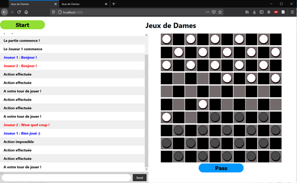

# Checkers Game

  

## Introduction
This project implements a multiplayer checkers game, based on a javascript server running under Node.js.

This server uses the Express and Socket.io modules, allowing it to respond asynchronously to the different requests from the two players present.

The web application allows two players to compete against each other during a game managed by the server, the interface also allows players to communicate via chat during their game.

## Setup
To function, the application requires Node.js installed on the computer.

After downloading the folder, run the server1.js file via a terminal on the folder address with the command: node server1.js .

After that, the server is started and can be accessed through the link: localhost:3000. Access it from two browser tabs to be able to play it in multiplayer.

## How to play
To play a game on the application, both players must first connect to the server address (localhost:3000). Then, these will have displayed the application interface.

To start the game, players must both have pressed the “Start” button, which will trigger the start of the game with a message in their chat.

Once the game begins, player 1 begins (player 1 is the first player connected and the next player is player 2) and performs the first action by clicking on the pawn to be moved and then on the target square. If the move is valid, it is made and player 2 can continue doing the same.

However, the game of checkers allows you to capture several enemy pawns in a single move if this is possible. Thus, when a player captures an opposing pawn, the turn is not automatically over and the player must press the skip turn button when no more pawn can be captured. This button also allows you to skip your turn if one of the players wants to do so.

The game then follows the usual rules of Checkers, when one of the players has won, the game stops automatically and the winning player is displayed in the chat. If one of the players disconnects, they recover the game data without reconnecting and the game is stopped until the player presses “Start” again.

To restart the game, both players must type the “/reload” command in the chat. The interface is refreshed and you must press “Start” again to launch the new game.

